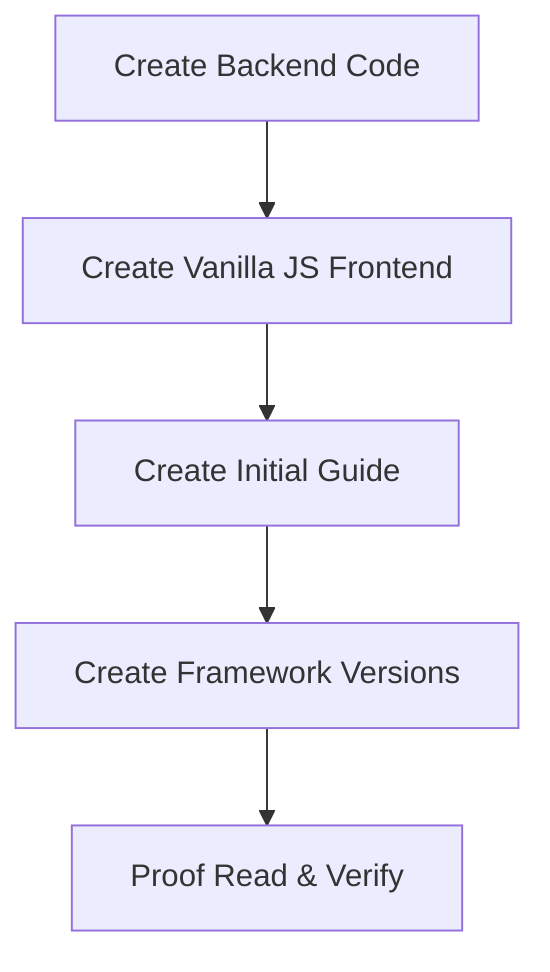

# Bryntum backend quick start guides

Backend quickstart guides for Bryntum that cover four possible combinations:

- Bryntum Product (e.g. Grid)
- Backend Framework (e.g. Express)
- Database (e.g. SQLite)
- Frontend Framework (e.g. React)

There are separate folders for the front end and back end code.

These are bare-minimum guides. They show you how to setup a minimal CRUD app. The Bryntum products use data stores such as events, dependencies, resources, and assignments. These examples use the minimal number of stores needed and only use common fields in the data stores. You can refer to the Bryntum docs to learn more about the relevant data stores and the fields they use:

- [Gantt: project data](https://bryntum.com/products/gantt/docs/guide/Gantt/data/project_data)
- [Scheduler: Displaying data](https://bryntum.com/products/scheduler/docs/guide/Scheduler/data/displayingdata)
- [Scheduler Pro: Displaying data](https://bryntum.com/products/schedulerpro/docs/guide/SchedulerPro/data/displayingdata)
- [Grid: Displaying data](https://www.bryntum.com/products/grid/docs/guide/Grid/data/displayingdata)
- [Calendar: Displaying data](https://bryntum.com/products/calendar/docs/guide/Calendar/data/displayingdata)
- [Task Board: Using a store](https://bryntum.com/products/taskboard/docs/guide/TaskBoard/data/storebasics)

## Front end

The front end examples use Vite and TypeScript and are in the `frontend` folder. 

Each front end example is named using the name of the Bryntum product and the front end framework used, separated by a dash and are all lowercase:

```
frontend
	gantt-vanilla
	gantt-react
	gantt-vue
	gantt-angular
	scheduler-vanilla
	...
```

## Backend

The back end examples are in the `backend` folder and are named using the name of the Bryntum product, the backend framework, and the database separated by dashes and are all lowercase:

```
backend
	gantt-express-sqlite
	scheduler-express-sqlite
	...
	gantt-django-sqlite
  ...
```

## Example data

In `example-json-data` folder.

## Quick start guides

In `guides` folder. 

## Creating code and guides with AI Agents

Claude Code and Amp were used to assist with creating the code and guides.

A typical workflow:

1. Create backend code in `backend` folder. Use existing guides or blog posts as a starting point. Simplify the code as much as possible. Use minimal data stores and features. Use Claude or Amp if needed.
2. Create vanilla JS frontend code in `frontend` folder. Use existing guides or blog posts as a starting point. Use minimal features. Use Claude or Amp if needed. 
3. Use Claude or Amp to create a guide in `guides` folder. Edit and proof read.
4. Use Claude or Amp and existing code and guides in this repo to create the frontend code and guides for JavaScript frameworks (React, Vue, Angular).
5. Proof read and edit the code and guides. Use Claude or Amp to double check the code and guides are correct.



### CLAUDE.md

For Claude Code coding agent (used after Amp agent)

 Tips for getting started:

 1. Run `/init` to create a `CLAUDE.md` file with instructions for Claude
 2. Use Claude to help with file analysis, editing, bash commands and git
 3. Be as specific as you would with another engineer for the best results
 4. ✔ Run `/terminal-setup` to set up terminal integration

 ※ Tip: Start with small features or bug fixes, tell Claude to propose a plan, and verify its suggested edits

### AGENT.md

For [Amp coding agent](https://ampcode.com/). Gives information about the project's codebase structure, development practices, and coding standards.

## Testing

[Playwright](https://playwright.dev/) is used to test CRUD operations. There's a test orchestrator (Node.js script) that manages the lifecycle of the backend and frontend servers and runs the tests.

### Overview of testing

🔧 **Test Orchestrator** (`tests/orchestrator.js`)

- Manages all backend/frontend combinations automatically
- Handles server lifecycle (start/stop/seed)
- Provides detailed results and error tracking
- Runs sequentially to avoid port conflicts

🧪 **CRUD Test Suites**

- `tests/gantt-crud.spec.js` - Task creation, editing, deletion, dependencies
- `tests/grid-crud.spec.js` - Player data CRUD, sorting, filtering
- `tests/scheduler-crud.spec.js` - Event management, drag/drop, resource handling
- ...

⚙️ **Configuration**

- `playwright.config.ts` - Chrome-only, optimized for server orchestration
- `package.json` script - `"test": "node tests/orchestrator.js",`

🚀 **Usage**

```shell
npm run test
```

This will test all of the backend/frontend combinations:

1. Start `express-sqlite-gantt` backend → Test with all 4 gantt frontends
2. Start `express-sqlite-grid` backend → Test with all 4 grid frontends
3. Start `express-sqlite-scheduler` backend → Test with all 4 scheduler 
frontends
4. ...

Each combination will be tested automatically with proper cleanup between runs.

> [!NOTE]  
> When you add frontend or backend code, add them to the `combinations` array in the `tests/orchestrator.js` file.

📊 **Results**

- Console output: Real-time progress with ✅/❌ status
- `test-results.json`: Detailed JSON results
- `playwright-report/`: HTML report with screenshots/videos on failures

🎯 **CRUD Operations Tested**

- Gantt: Create/edit/delete tasks, sync with backend, dependencies
- Grid: Create/edit/delete players, field editing, API syncScheduler:
- Create/edit/delete events, drag/drop, resize, resources
...

### Test orchestrator details

This `tests/orchestrator.js` file is a test orchestrator script designed to automate the testing of each combination of frontend and backend applications using Playwright and Node.js. It runs with a single command:

```js
npm run test
```

Its primary job is to:

- Loop through predefined combinations of backend services (e.g. `express-sqlite-gantt`) and frontend applications (e.g. `gantt-angular` and `gantt-react`).
- For each combination, it starts the backend server and the frontend development server.
- Once both servers are running, it executes a corresponding Playwright test suite (`*-crud.spec.js`).
- It manages and cleans up the server processes after each test run to avoid PORT in use conflicts.
- Finally, it collects the results of all test runs, prints a summary to the console, saves a test report to `test-results.json`, and exits with a status code indicating whether all tests passed or not.

#### Detailed breakdown

##### Imports and Initial Setup 

**Imports**: It imports Node.js built-in modules: `spawn` for creating child processes, `fs` for file system operations, `path` for handling file paths, `url` to help resolve module paths, and `process` for interacting with the current Node.js process.

**Path Constants**: `__dirname` and `rootDir` provide paths to the current script's directory (`tests/`) and the project's root directory (`/`).

**Configuration Constants**:

- **`BACKEND_PORT` & `FRONTEND_PORT`**: Defines the network ports the script will expect the servers to run on.
- **`SERVER_TIMEOUT` & `TEST_TIMEOUT`**: Sets maximum wait times to prevent the script from hanging indefinitely if a server fails to start or a test gets stuck.
- **`activeProcesses`**: A Set to keep track of all spawned child processes (servers) so they can be reliably shut down later, even if an error occurs.

##### Test Combinations 

The `combinations` array is the heart of the orchestrator's configuration. It defines the test matrix. Each object in the array represents a product type (Gantt, Grid, Scheduler, ...) and contains:

- **`backend`**: The name of the backend directory.
- **`frontends`**: An array of corresponding frontend directories to test against that backend.
- **`product`**: A short name for the product, used to select the correct Playwright test file (e.g., `gantt-crud.spec.js`).

##### TestResults Class

This class is a simple data structure for tracking and reporting test outcomes.

- **`constructor()`**: Initializes arrays to hold all results, just passed results, and just failed results.
- **`add()`**: Adds a new test result, categorizing it as 'PASS' or 'FAIL'.
- **summary():** Prints a formatted summary to the console, showing totals and listing the failed and passed combinations separately. It returns true if all tests passed.

##### Server and Test Management Functions

- **`waitForPort()`**: A utility function that repeatedly tries to fetch from a given port until it gets a response or a timeout is reached. This is crucial for ensuring a server is fully booted and ready to accept requests before the tests start.
- **`startBackend()`** & **`startFrontend()`**: These functions are very similar. They take the name of a backend or frontend application.
- They first try to kill any process that might already be running on the target port using `killProcessOnPort`.
- For the backend, it first runs `npm run seed` to initialize the database.
- They then use `spawn('npm', ['run', 'dev'], ...)` to start the development server in the correct directory.
- They listen to the stdout and stderr of the new process to log output and detect when the server is ready.
- The new process is added to the `activeProcesses` set for cleanup.
- They call `waitForPort` to confirm the server is live before returning the process object.

##### runTests

This function spawns the Playwright test runner (`npx playwright test ...).
- It passes the backend, frontend, and product names as environment variables so the test file knows which context it's running in.
- It returns a Promise that resolves if the tests pass (exit code 0) and rejects if they fail or time out.

##### Process Cleanup Functions

These are critical helper functions for ensuring a clean state between test runs.

- **`killProcessOnPort()`**: Uses the command-line tool lsof (List Open Files) to find the Process ID (PID) of any process using a specific port and then kills it. This prevents "port in use" errors.
- **`killProcess()`**: Gracefully kills a specific process that was spawned by the script. It first tries a gentle `SIGTERM` and then a forceful `SIGKILL` if the process doesn't shut down.
- **`killAllActiveProcesses()`**: Iterates through the activeProcesses set and kills every process. This is the main cleanup function, used when the script finishes or is interrupted.

##### Main Orchestration Logic (runAllTests)

This is the main function that executes the entire test plan.

- It creates a new TestResults instance.
- It iterates through the combinations array (the outer loop is for backends).
- Backend Lifecycle: It starts the backend server. If this fails, it marks all associated frontend tests as failed and moves to the next backend.
- Frontend Lifecycle: It then enters an inner loop for all frontends associated with the current backend.
- It starts the frontend server.
- It runs the Playwright tests.
- It records the result ('PASS' or 'FAIL').
- It cleans up by stopping the frontend server.
- After all frontends for a backend are tested, it cleans up by stopping the backend server.
- Reporting: Once all combinations are tested, it calls results.summary() to print the report, writes the full data to `test-results.json`, and exits with code 0 (success) or 1 (failure).

##### Process Event Handlers and Execution (Lines 443-485)

- **Signal Handlers (`SIGINT`, `SIGTERM`):** These ensure that if you interrupt the script (e.g., with Ctrl+C), it will run `killAllActiveProcesses` to shut down any running servers before exiting.

- **Exception Handlers (`uncaughtException`, `unhandledRejection`):** These are safety nets. If an unexpected error occurs anywhere in the script, they will log the error, run the cleanup function, and exit.

- **Execution Trigger:** The final if block checks if the file is being run directly from the command line. If so, it calls runAllTests() to start the process. This allows the functions in this file to also be exported and potentially used by other scripts without automatically running the tests.