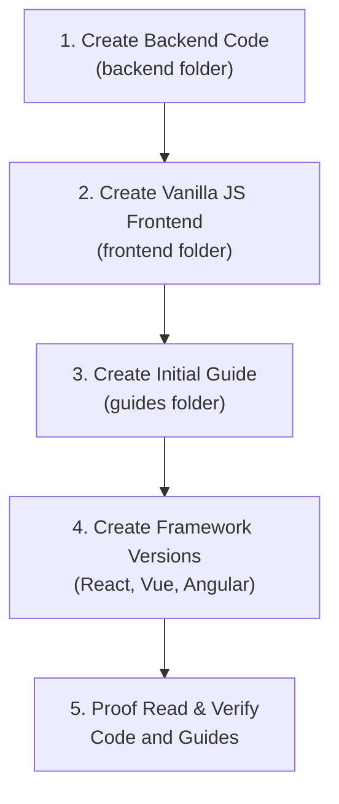

# Bryntum backend quick start guides

Backend quickstart guides for Bryntum that cover four possible combinations:

- Bryntum Product (e.g. Grid)
- Backend Framework (e.g. Express)
- Database (e.g. SQLite)
- Frontend Framework (e.g. React)

There are separate folders for the front end and back end code.

These are bare-minimum guides. They show you how to setup a minimal CRUD app. The Bryntum products use data stores such as events, dependencies, resources, and assignments. These examples use the minimal number of stores needed and only use common fields in the data stores. You can refer to the Bryntum docs to learn more about the relevant data stores and the fields they use:

- [Gantt: project data](https://bryntum.com/products/gantt/docs/guide/Gantt/data/project_data)
- [Scheduler: Displaying data](https://bryntum.com/products/scheduler/docs/guide/Scheduler/data/displayingdata)
- [Scheduler Pro: Displaying data](https://bryntum.com/products/schedulerpro/docs/guide/SchedulerPro/data/displayingdata)
- [Grid: Displaying data](https://www.bryntum.com/products/grid/docs/guide/Grid/data/displayingdata)
- [Calendar: Displaying data](https://bryntum.com/products/calendar/docs/guide/Calendar/data/displayingdata)
- [Task Board: Using a store](https://bryntum.com/products/taskboard/docs/guide/TaskBoard/data/storebasics)

## Front end

The front end examples use Vite and TypeScript and are in the `frontend` folder. 

Each front end example is named using the name of the Bryntum product and the front end framework used, separated by a dash and are all lowercase:

```
frontend
	gantt-vanilla
	gantt-react
	gantt-vue
	gantt-angular
	scheduler-vanilla
	...
```

## Backend

The back end examples are in the `backend` folder and are named using the name of the Bryntum product, the backend framework, and the database separated by dashes and are all lowercase:

```
backend
	gantt-express-sqlite
	scheduler-express-sqlite
	...
	gantt-django-sqlite
  ...
```

## Example data

In `example-json-data` folder.

## Quick start guides

In `guides` folder. 

## Creating code and guides with AI Agents

Claude Code and Amp were used to assist with creating the code and guides.

A typical workflow:

1. Create backend code in `backend` folder. Use existing guides or blog posts as a starting point. Simplify the code as much as possible. Use minimal data stores and features. Use Claude or Amp if needed.
2. Create vanilla JS frontend code in `frontend` folder. Use existing guides or blog posts as a starting point. Use minimal features. Use Claude or Amp if needed. 
3. Use Claude or Amp to create a guide in `guides` folder. Edit and proof read.
4. Use Claude or Amp and existing code and guides in this repo to create the frontend code and guides for JavaScript frameworks (React, Vue, Angular).
5. Proof read and edit the code and guides. Use Claude or Amp to double check the code and guides are correct.



### CLAUDE.md

For Claude Code coding agent (used after Amp agent)

 Tips for getting started:

 1. Run `/init` to create a `CLAUDE.md` file with instructions for Claude
 2. Use Claude to help with file analysis, editing, bash commands and git
 3. Be as specific as you would with another engineer for the best results
 4. ✔ Run `/terminal-setup` to set up terminal integration

 ※ Tip: Start with small features or bug fixes, tell Claude to propose a plan, and verify its suggested edits

### AGENT.md

For [Amp coding agent](https://ampcode.com/). Gives information about the project's codebase structure, development practices, and coding standards.
